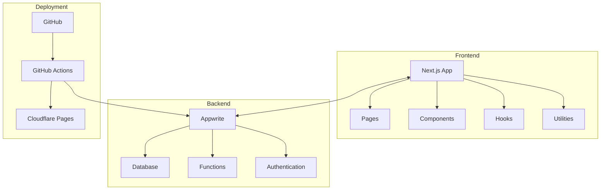
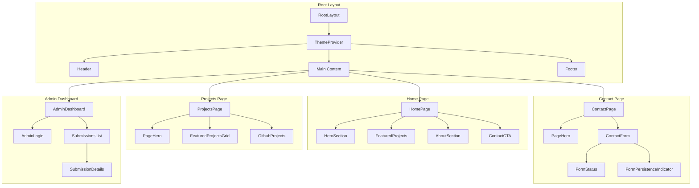
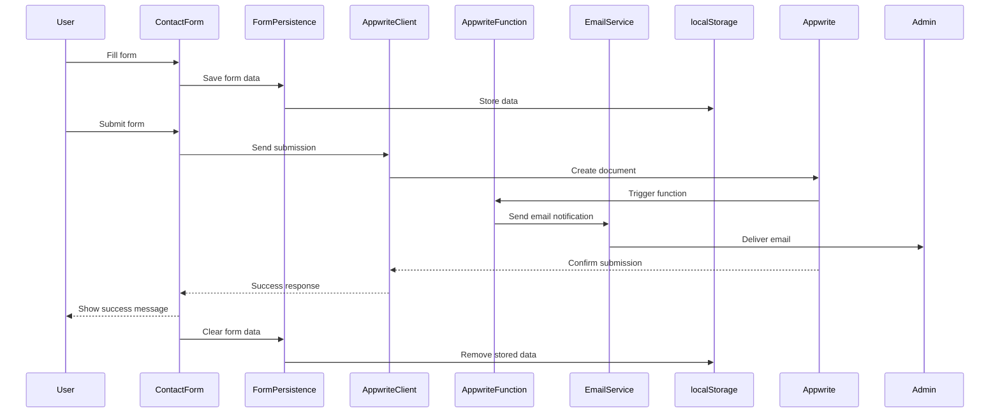
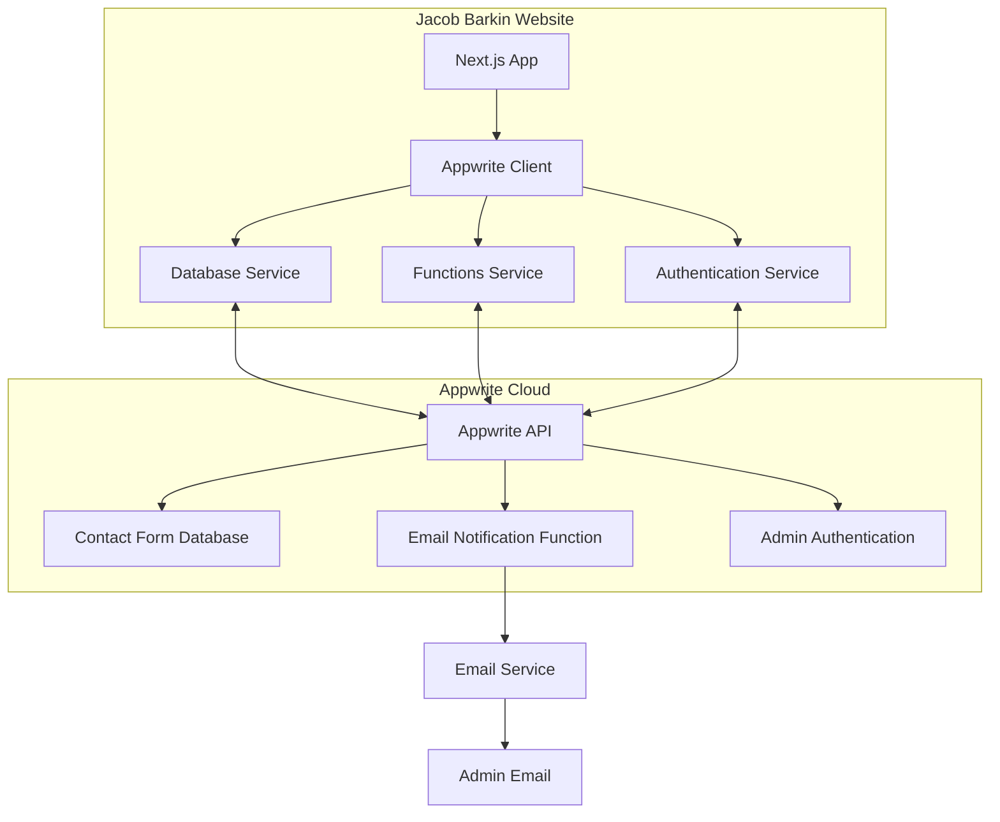
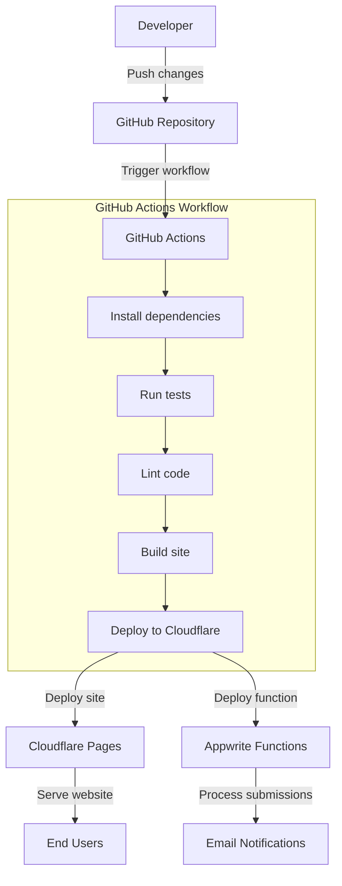
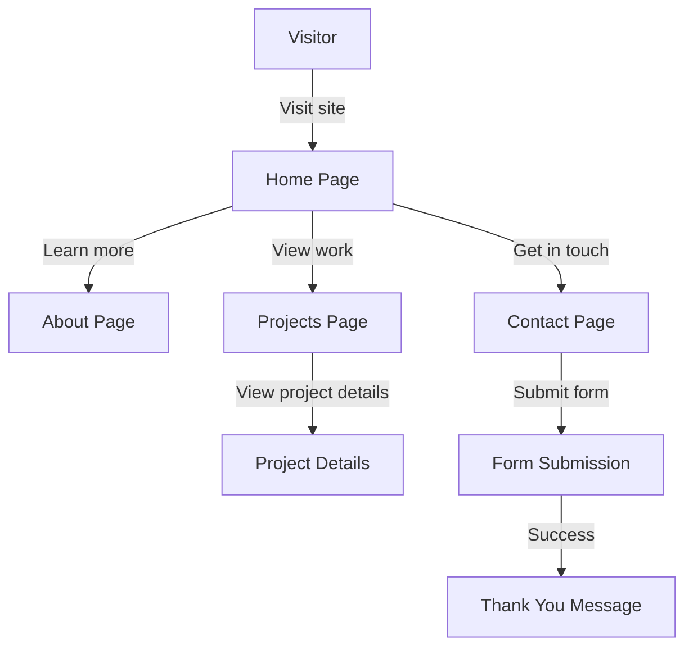
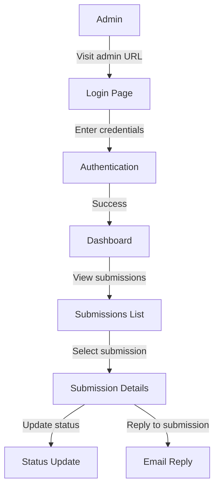

# Visual Documentation

This document provides visual diagrams and illustrations to help understand the architecture, workflows, and components of the Jacob Barkin Portfolio website.

## Table of Contents

- [Project Architecture](#project-architecture)
- [Component Hierarchy](#component-hierarchy)
- [Data Flow](#data-flow)
- [Appwrite Integration](#appwrite-integration)
- [Deployment Workflow](#deployment-workflow)
- [User Flows](#user-flows)

## Project Architecture

The following diagram illustrates the high-level architecture of the Jacob Barkin Portfolio website:

### Key Components

- **Frontend**: Next.js application with React components, custom hooks, and utilities
- **Backend**: Appwrite services for database, functions, and authentication
- **Deployment**: GitHub repository with GitHub Actions for CI/CD, deploying to Cloudflare Pages

## Component Hierarchy

The following diagram shows the component hierarchy for the main pages of the website:

## Data Flow

The following diagram illustrates the data flow for the contact form submission process:

## Appwrite Integration

The following diagram shows how the website integrates with Appwrite services:

### Key Integration Points

1. **Contact Form**:
   - Submissions stored in Appwrite database
   - Email notifications sent via Appwrite function

2. **Admin Dashboard**:
   - Authentication via Appwrite
   - Submission data retrieved from Appwrite database

3. **API Integration**:
   - Client-side SDK for public features
   - Server-side API for admin features

## Deployment Workflow

The following diagram illustrates the CI/CD workflow for deploying the website:

### Deployment Steps

1. **Code Push**: Developer pushes changes to GitHub
2. **CI/CD Trigger**: GitHub Actions workflow is triggered
3. **Build Process**: Dependencies installed, tests run, site built
4. **Deployment**: Site deployed to Cloudflare Pages, functions to Appwrite
5. **Availability**: Website available to end users

## User Flows

### Visitor Flow

The following diagram shows the typical flow for a website visitor:

### Admin Flow

The following diagram shows the typical flow for an admin user:

## Component Screenshots

### Home Page Hero Section

The home page hero section features:
- Animated gradient background
- Profile image
- Name and title with gradient text
- Brief introduction
- Call-to-action buttons

### Projects Grid

The projects grid features:
- Featured projects with larger cards
- Project thumbnails with hover effects
- Technology tags
- Links to live projects and GitHub repositories

### Contact Form

The contact form features:
- Input validation with error messages
- Form persistence with auto-save
- Submission status indicator
- Responsive design for all devices

### Admin Dashboard

The admin dashboard features:
- Secure login with Appwrite authentication
- List of form submissions with filtering and sorting
- Detailed view of individual submissions
- Status management for submissions

## Mobile Responsiveness

### Mobile Navigation

The mobile navigation features:
- Hamburger menu for small screens
- Animated menu transitions
- Full-screen navigation overlay
- Current page indicator

### Mobile Home Page

The mobile home page features:
- Optimized layout for small screens
- Adjusted typography and spacing
- Stacked content for better readability
- Touch-friendly interactive elements

### Mobile Contact Form

The mobile contact form features:
- Full-width inputs for better touch interaction
- Optimized keyboard experience
- Clear error messages
- Appropriate input types for mobile (tel, email, etc.)
